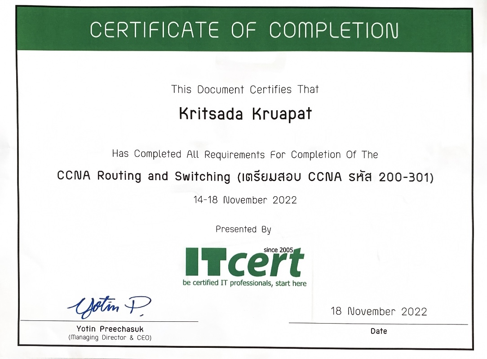

# My Network Certificate:

# My Cloud Certificate:

# This is the way use for practice:
## Cisco Packet Tracer Labs and Study Materials
This repository contains various Cisco Packet Tracer labs and study materials for networking enthusiasts and students. These resources cover a range of topics from basic router configuration to advanced VLAN setups and HSRP configurations.

## Packet Tracer Lab Files

- **(Optional) Packet Tracer - Configure DHCPv4.pka**
- **(Optional) Packet Tracer - Configure Layer 3 Switching and Inter-VLAN Routing.pka**
- **(Optional) Packet Tracer - HSRP Configuration Guide.pka**
- **01 Packet Tracer - Configure Router Interfaces.pka**
- **02 Packet Tracer - VLAN Configuration.pka**
- **03 Packet Tracer - Configure Trunks.pka**
- **04 Packet Tracer - Configure Router-on-a-Stick Inter-VLAN Routing.pka**
- **05 Packet Tracer - Configure EtherChannel.pka**
- **06 Packet Tracer - Configure IPv4 and IPv6 Static and Default Routes.pka**
- **07 Packet Tracer - Modify Single-Area OSPFv2.pka**
- **08 Packet Tracer - Single-Area OSPFv2 Configuration.pka**
- **09 Packet Tracer - Configure and Modify Standard IPv4 ACLs.pka**
- **10 Packet Tracer - Configure Extended IPv4 ACLs - Scenario 1.pka**
- **11 Packet Tracer - Configure Extended IPv4 ACLs - Scenario 2.pka**
- **12 Packet Tracer - Configure NAT for IPv4.pka**

## Study Materials

- **ENSA_Module_1.pdf**
- **ENSA_Module_2.pdf**
- **ENSA_Module_3.pdf**
- **ENSA_Module_4.pdf**
- **ENSA_Module_5.pdf**
- **SRWE_Module_1.pdf**
- **SRWE_Module_2.pdf**
- **SRWE_Module_3.pdf**
- **SRWE_Module_4.pdf**
- **SRWE_Module_5.pdf**
- **SRWE_Module_6.pdf**
- **SRWE_Module_9.pdf**
- **SRWE_Module_14.pdf**
- **SRWE_Module_15.pdf**
- **IP Subnetting Workbook (Self Study).pdf**
- **VLSM Workbook (Self Study).pdf**
- **cisco.pdf**
- **ciscoRouter3.pdf**
- **ciscoRouterPreparr.pdf**
- **topolory.pkt**

## How to Use

1. Download and install [Cisco Packet Tracer](https://www.netacad.com/courses/packet-tracer).
2. Clone or download this repository to your local machine.
3. Open the `.pka` files with Cisco Packet Tracer to start the labs.
4. Refer to the PDF documents for study materials and additional instructions.

